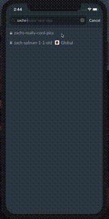
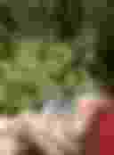
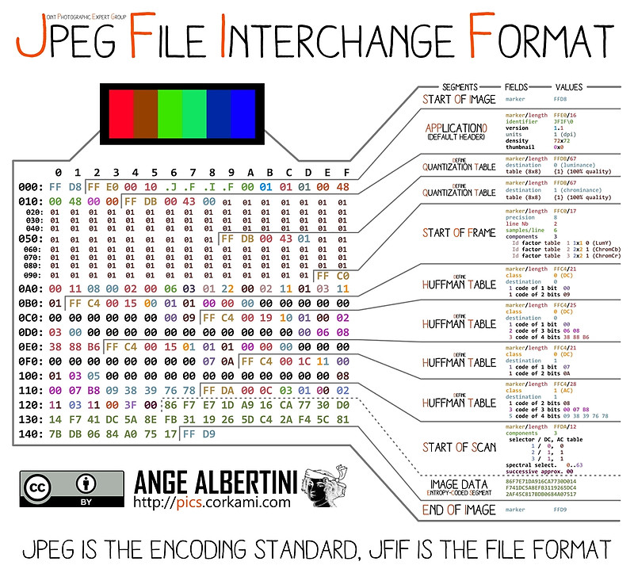

# Tiny Thumb
A novel form of image compression based on predetermined JPEG parameters.

This method is particularly useful in client/server models where payload size is a concern and custom client side manipulation of the payload, prior to display, is possible. At the time of writing Slack uses this algorithm in its product to efficiently inline image previews into certain API responses. These previews are displayed to end users while the high resolution content is being fetched over the network.



## Example Usage
In the example below we will shrink a 13298 byte image down to 210 bytes and then scale it back up and apply a gaussian blur.

```
% identify img/cy.jpg
img/cy.jpg JPEG 128x171 128x171+0+0 8-bit sRGB 13298B 0.000u 0:00.000

% go run main.go -d 64 -o img/tiny-cy.jpg img/cy.jpg    
{
  "Debug": {
    "Parameters": {
      "Quality": 7,
      "Head": "/9j/2wCEAHJPVmRWR3JkXWSBeXKIq/+6q52dq//6/8////////////////////////////////////////////////////8BeYGBq5ar/7q6///////////////////////////////////////////////////////////////////////////AABEIAAAAAAMBIgACEQEDEQH/xAGiAAABBQEBAQEBAQAAAAAAAAAAAQIDBAUGBwgJCgsQAAIBAwMCBAMFBQQEAAABfQECAwAEEQUSITFBBhNRYQcicRQygZGhCCNCscEVUtHwJDNicoIJChYXGBkaJSYnKCkqNDU2Nzg5OkNERUZHSElKU1RVVldYWVpjZGVmZ2hpanN0dXZ3eHl6g4SFhoeIiYqSk5SVlpeYmZqio6Slpqeoqaqys7S1tre4ubrCw8TFxsfIycrS09TV1tfY2drh4uPk5ebn6Onq8fLz9PX29/j5+gEAAwEBAQEBAQEBAQAAAAAAAAECAwQFBgcICQoLEQACAQIEBAMEBwUEBAABAncAAQIDEQQFITEGEkFRB2FxEyIygQgUQpGhscEJIzNS8BVictEKFiQ04SXxFxgZGiYnKCkqNTY3ODk6Q0RFRkdISUpTVFVWV1hZWmNkZWZnaGlqc3R1dnd4eXqCg4SFhoeIiYqSk5SVlpeYmZqio6Slpqeoqaqys7S1tre4ubrCw8TFxsfIycrS09TV1tfY2dri4+Tl5ufo6ery8/T19vf4+fr/2gAMAwEAAhEDEQA/AA==",
      "DimensionOffset": 141
    },
    "Final": "/9j/2wCEAHJPVmRWR3JkXWSBeXKIq/+6q52dq//6/8////////////////////////////////////////////////////8BeYGBq5ar/7q6///////////////////////////////////////////////////////////////////////////AABEIAEAALwMBIgACEQEDEQH/xAGiAAABBQEBAQEBAQAAAAAAAAAAAQIDBAUGBwgJCgsQAAIBAwMCBAMFBQQEAAABfQECAwAEEQUSITFBBhNRYQcicRQygZGhCCNCscEVUtHwJDNicoIJChYXGBkaJSYnKCkqNDU2Nzg5OkNERUZHSElKU1RVVldYWVpjZGVmZ2hpanN0dXZ3eHl6g4SFhoeIiYqSk5SVlpeYmZqio6Slpqeoqaqys7S1tre4ubrCw8TFxsfIycrS09TV1tfY2drh4uPk5ebn6Onq8fLz9PX29/j5+gEAAwEBAQEBAQEBAQAAAAAAAAECAwQFBgcICQoLEQACAQIEBAMEBwUEBAABAncAAQIDEQQFITEGEkFRB2FxEyIygQgUQpGhscEJIzNS8BVictEKFiQ04SXxFxgZGiYnKCkqNTY3ODk6Q0RFRkdISUpTVFVWV1hZWmNkZWZnaGlqc3R1dnd4eXqCg4SFhoeIiYqSk5SVlpeYmZqio6Slpqeoqaqys7S1tre4ubrCw8TFxsfIycrS09TV1tfY2dri4+Tl5ufo6ery8/T19vf4+fr/2gAMAwEAAhEDEQA/AIgc9SKXPP1pMc5FL39aQCZ4Pr6Ug7+lOxnmmUAOB+X6UH3pcfKe2KaaAHDqcVIePTFGMgYGDS5PPHtSAZwck+tBUAZUdKdwDg4GaYcsDgcCgA5INRk5p7ZUDB4NMamBMeDjpSbjkcE0m7pnnPapCr7ehNIBOOhApowp21IFIQE/eNIBg5z+VOwCBflI2nFRMMVZZiF61CX3dqB2JywJ4A+tIrc0Pt28jioN208UAWOCRScbuuKaGDDIOKQtk4PBoASVsnAplJ3NFBSP/9k=",
    "Height": 64,
    "Width": 47,
    "PayloadLen": 210,
    "MaxDimension": 64
  },
  "Payload": "AQBAAC+IHPUilzz9aTHORS9/WkAmeD6+lIO/pTsZ5plADgfl+lB96XHyntimmgBw6nFSHj0xRjIGBg0uTzx7UgGcHJPrQVAGVHSncA4OBmmHLA4HAoAOSDUZOae2VAweDTGpgTHg46Um45HBNJu6Z5z2qQq+3oTSATjoQKaMKdtSBSEBP3jSAYOc/lTsAgX5SNpxUTDFWWYhetQl93agdicsCeAPrSK3ND7dvI4qDdtPFAFjgkUnG7rimhgwyDikLZODwaAElbJwKZSdzRQUj//Z"
}


% convert img/tiny-cy.jpg -resize 128 -blur 0x4 img/tiny-cy-blur.jpg
```

| Original | Tiny | Tiny Rescaled and Blurred |
| --- | --- | --- |
|  |  |  |

## High Level Tiny Thumb Generation Algorithim
- Convert the image to a jpeg.
- Scale it down.
- Reduce its 'quality' using predetermined, hardcoded parameters.
- Strip the jpeg header.

## Program Output and Reconstitution Algorithim
The output of this program is a json object containing the key `Payload` whose value is a base64 encoded byte array. The base64 header can be found in the key `Debug.Head`, and the dimension offset in `Debug.DimensionOffset`.

It is expected that a server and client will preshare the mapping from all known types to there corresponding headers and dimension offsets. Upon receiving a payload a client can reconstitute the full JPEG by using the following process:

- Split payload into three parts; the first byte is the `$type`, the next four bytes are the `$dimensions`, and the remaining bytes are the `$tail`.
- Get the corresponding preshared `$header` and `$dimension_offset` for `$type`. If you do not have values for this `$type`, fail.
- Set the four bytes of `$header` beginning at offset `$dimension_offset` to the value of `$dimensions`.
- Concatenate `$header` and `$tail` to get the final result.
- Optional: Scale up and apply a gaussian blur. :sparkles:

## Options and Configuration
This program takes two options that can be changed; the 'type' and the 'maximum dimension'. Each type corresponds to a specific jpeg 'header' and 'dimension offset'. This program includes a mapping of types currently used by Slack, the details of which can be found in the program output or source code.

## Debugging Tips
- Use `cmp` to determine if the first n bytes of a file are identical.
- The -o flag can be used to output the entire image for debuggling.

## References


The full JPEG specification: https://www.w3.org/Graphics/JPEG/jfif3.pdf

Some discussion of this technique can be found online:
- https://stackoverflow.com/questioins/56236805/create-jpeg-thumb-image-with-general-fixed-header
- https://engineering.fb.com/android/the-technology-behind-preview-photos
